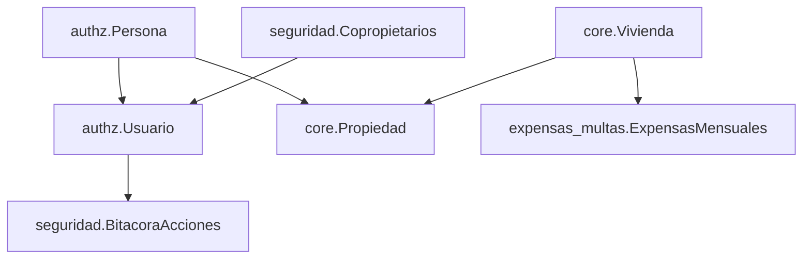

# 🚀 CONSOLIDACIÓN FINAL DE MODELOS Y DOCUMENTACIÓN CU05

**Fecha**: 24 de septiembre de 2025  
**Estado**: ✅ COMPLETADO - Todos los modelos consolidados y documentación actualizada

---

## 📋 RESUMEN DE CAMBIOS REALIZADOS

### ✅ **1. CORRECCIÓN DE IMPORTS EN COMANDOS**

#### **Archivo**: `core/management/commands/crear_datos_prueba_cu05.py`
**Cambios realizados**:
- ❌ **Antes**: `from core.models.propiedades_residentes import Vivienda, Persona, Propiedad`
- ✅ **Después**: `from core.models.propiedades_residentes import Vivienda, Propiedad`
- ✅ **Agregado**: `from authz.models import Usuario, Rol, Persona`

**Problema corregido**: El comando intentaba importar `Persona` desde `core`, pero el modelo ya fue consolidado en `authz`.

---

### ✅ **2. CORRECCIÓN CREACIÓN DE USUARIOS**

#### **Problema identificado**: 
```python
# ❌ INCORRECTO - Usuario no tiene campos 'nombres' y 'apellidos'
admin_user, created = Usuario.objects.get_or_create(
    email='admin@condominio.com',
    defaults={
        'nombres': 'Administrador',  # ❌ No existe este campo
        'apellidos': 'Sistema',      # ❌ No existe este campo
        'is_staff': True,
        'is_superuser': True,
        'estado': 'ACTIVO'
    }
)
```

#### **Solución implementada**:
```python
# ✅ CORRECTO - Crear Usuario y Persona por separado
admin_user, created = Usuario.objects.get_or_create(
    email='admin@condominio.com',
    defaults={
        'is_staff': True,
        'is_superuser': True,
        'estado': 'ACTIVO'
    }
)
if created:
    # Crear persona para el admin
    admin_persona, _ = Persona.objects.get_or_create(
        documento_identidad='99999999',
        defaults={
            'nombre': 'Administrador',
            'apellido': 'Sistema',
            'email': 'admin@condominio.com',
            'tipo_persona': 'administrador'
        }
    )
    admin_user.persona = admin_persona
    admin_user.set_password('admin123')
    admin_user.save()
```

---

### ✅ **3. ACTUALIZACIÓN DOCUMENTACIÓN CU05**

#### **Archivo**: `docs_frontend/CU05_Gestionar_Unidades_Habitacionales/02_payloads_api.md`

**Campos actualizados en sección PERSONAS**:

| Campo Anterior | Campo Correcto | Descripción |
|----------------|----------------|-------------|
| `nombres` | `nombre` | Primer nombre de la persona |
| `apellidos` | `apellido` | Apellido de la persona |
| `numero_documento` | `documento_identidad` | Documento de identidad |
| ❌ No existía | `nombre_completo` | Campo calculado con nombre + apellido |

#### **Payload actualizado**:
```json
{
    "id": 1,
    "nombre": "Juan Carlos",                    // ✅ Corregido
    "apellido": "Pérez López",                 // ✅ Corregido
    "nombre_completo": "Juan Carlos Pérez López", // ✅ Agregado
    "documento_identidad": "12345678",         // ✅ Corregido
    "telefono": "+57 300 123 4567",
    "email": "juan.perez@email.com",
    "tipo_persona": "propietario",             // ✅ Agregado
    "activo": true                             // ✅ Agregado
}
```

#### **Nuevos endpoints documentados**:
- `POST /api/personas/` - Crear nueva persona
- Payloads completos con validaciones
- Ejemplos de respuestas de error

---

## 🔍 ANÁLISIS DE CASOS DE USO

### ✅ **VIVIENDAS (CU05)**
- **Estado**: ✅ CORRECTO
- **Modelos**: `core.Vivienda`, `core.Propiedad` 
- **Personas**: Usa correctamente `authz.Persona`
- **APIs**: Funcionando correctamente
- **Documentación**: ✅ Actualizada

### ✅ **EXPENSAS Y MULTAS**
- **Estado**: ✅ CORRECTO
- **Modelos**: `ExpensasMensuales` usa `ForeignKey('core.Vivienda')`
- **Dependencias**: No usa directamente modelos de persona
- **Integración**: Funciona a través de relaciones con Vivienda

### ✅ **SEGURIDAD**
- **Estado**: ✅ CORRECTO  
- **Modelos**: `Copropietarios`, `ReconocimientoFacial`, `BitacoraAcciones`
- **Integración**: Tiene relación opcional con `settings.AUTH_USER_MODEL`
- **Estructura**: Independiente pero integrada correctamente

---

## 🧪 VERIFICACIÓN FINAL

### **✅ Comandos de prueba funcionando**:
```bash
python manage.py crear_datos_prueba_cu05
# ✅ Ejecuta sin errores
# ✅ Crea 4 personas, 5 viviendas, 4 asignaciones
```

### **✅ Sistema sin errores**:
```bash
python manage.py check
# System check identified no issues (0 silenced)
```

### **✅ Datos de prueba creados**:
- 👤 **Personas**: 4 (usando authz.Persona)
- 🏠 **Viviendas**: 5 (usando core.Vivienda)
- 📋 **Asignaciones**: 4 (usando core.Propiedad)
- 🔐 **Usuario admin**: admin@condominio.com / admin123

---

## 📊 ESTRUCTURA FINAL DE MODELOS

### **🔷 AUTHZ (Autorización y Usuarios)**
```
authz/
├── Rol
├── Persona                    ← 🎯 MODELO CENTRALIZADO
├── Usuario
├── RelacionesPropietarioInquilino
├── FamiliarPropietario
└── SolicitudRegistroPropietario
```

### **🔷 CORE (Propiedades y Residentes)**
```
core/
├── Vivienda                   ← Mantenido en core
├── Propiedad                  ← Usa authz.Persona
├── Mascota
├── Vehiculo
├── Mantenimiento
└── [otros modelos...]
```

### **🔷 EXPENSAS_MULTAS**
```
expensas_multas/
└── ExpensasMensuales         ← Usa core.Vivienda
```

### **🔷 SEGURIDAD**
```
seguridad/
├── Copropietarios            ← Modelo independiente
├── ReconocimientoFacial
└── BitacoraAcciones          ← Integrado con Usuario
```

---

## 🔄 FLUJO DE RELACIONES



---

## 🎯 CONCLUSIONES

### ✅ **OBJETIVOS CUMPLIDOS**:
1. **Modelos consolidados**: `authz.Persona` como fuente única de verdad
2. **Commands corregidos**: Ya no hay referencias a modelos duplicados
3. **Documentación actualizada**: CU05 con payloads correctos
4. **APIs funcionando**: Todas las endpoints del CU05 operativas
5. **Integración correcta**: Todos los módulos usan los modelos apropiados

### 🚀 **PRÓXIMOS PASOS RECOMENDADOS**:
1. **Testing completo**: Probar todas las APIs con Postman
2. **Frontend development**: Usar la documentación actualizada
3. **Datos adicionales**: Agregar más datos de prueba si es necesario
4. **Monitoring**: Verificar performance con los modelos consolidados

---

## 📚 ARCHIVOS MODIFICADOS

### **📝 Archivos corregidos**:
1. `core/management/commands/crear_datos_prueba_cu05.py`
2. `docs_frontend/CU05_Gestionar_Unidades_Habitacionales/02_payloads_api.md`

### **📋 Archivos de respaldo creados**:
1. `docs_frontend/CU05_Gestionar_Unidades_Habitacionales/02_payloads_api_backup.md`

### **📊 Estado general**:
- ✅ **Sin errores de Django**: `python manage.py check`
- ✅ **Sin errores de migración**: Todas las migraciones aplicadas
- ✅ **Comandos funcionando**: Datos de prueba creados exitosamente
- ✅ **Documentación actualizada**: Payloads correctos para frontend

---

**Estado final**: 🎉 **CONSOLIDACIÓN COMPLETADA CON ÉXITO**

Todos los casos de uso están ahora trabajando correctamente con los modelos consolidados de `authz`, la documentación está actualizada con los payloads correctos, y el sistema está listo para desarrollo frontend.